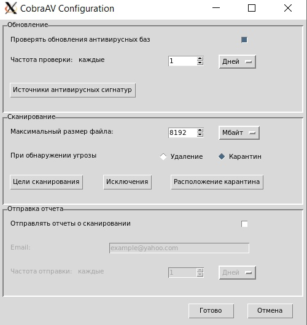
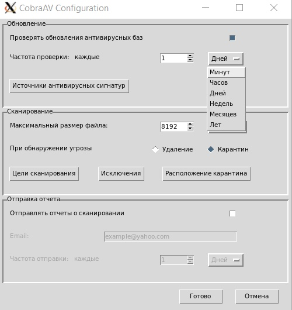
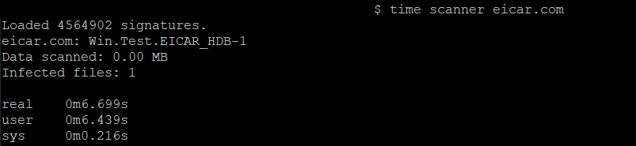

# CobraAV

  
## Инструкция по использованию предварительной версии:

- Скачать файл [tools/putty.exe](tools/putty.exe) из данного репозитория.
Поместить его в одну директорию с файлом `server.cmd`, предоставляемым Вам отдельно
- Скачать, установить и запустить [Xming](http://www.straightrunning.com/XmingNotes/)
- Запустить `server.cmd`
- Выполнить команду `cobra config` для демонстрации графического конфигуратора
- Выполнить команду `cobra start/stop/status` для демонстрации управления службой сканирования
- Выполнить команду `scanner имена файлов` для демонстрации сканирования файлов  

***Обратите внимание:***
- на данном этапе разработки служба сканирования и утилита `scanner` загружают антивирусные сигнатуры раздельно! (потребляют в два раза больше памяти)
- для всех команд работает [умное авто-дополнение bash](unix/cobra.sh)

  

## Демонстрация работы программы:  
### Графический конфигуратор:  
   

### Потребление памяти:  
  

### Результаты сканирования:  
  
