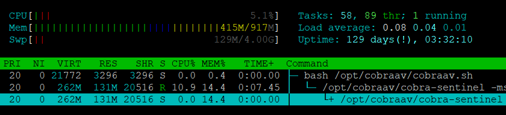

# CobraAV

<br><br/>
## Использование

### Установка:
- Скачать дистрибутив программы из раздела [Releases](https://github.com/COOLIRON2311/CobraAV/releases)
- Установить его командой `sudo apt install ./cobraav_0.1_amd64.deb`

### Использование live-версии программы:
- Скачать файл [tools/putty.exe](tools/putty.exe) из данного репозитория.
Поместить его в одну директорию с файлом `server.cmd`, предоставляемым Вам отдельно
- Скачать, установить и запустить [Xming](http://www.straightrunning.com/XmingNotes/)
- Запустить `server.cmd`
- Протестировать утилиту `cobra` согласно следующей инструкции:
```
Usage: cobra [command] [file]                                     
                                                                  
Commands:                                                         
                                                                  
 start/stop/status - Cobra Sentinel service control (reqires root)
 (de)contain       - Move file from/to quarantine                 
 remove            - Delete contained threat                      
 config            - Open configuration interface                 
 scan              - Manually specify scan target                 
 whitelist         - Add file signature to exceptions list        
 blacklist         - Add file signature to malware database       
 list-threats      - View contained threats                       
 clear-threats     - Delete all contained threats                 
``` 
<br><br/>

***Обратите внимание:***
- для всех команд работает [умное авто-дополнение bash](unix/cobra.sh)


<br><br/>

## Демонстрация работы программы:<br><br/>
### Графический конфигуратор: (NEW!)<br><br/>
 <br><br/>

### Потребление памяти: (NEW!)<br><br/>
<br><br/>

### Результаты сканирования: (NEW!)<br><br/>
<br><br/>
