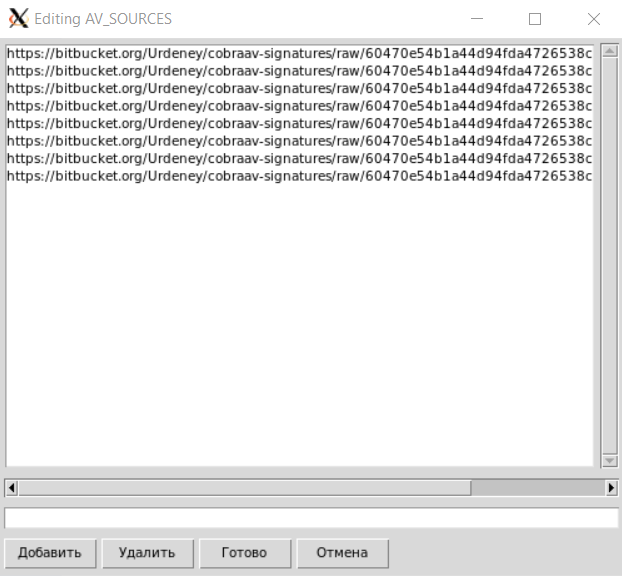

# CobraAV

<br><br/>
## Usage

### Setup:
- Download the latest version from [Releases](https://github.com/COOLIRON2311/CobraAV/releases)
- Install the package via command `sudo apt install ./cobraav_1.1_amd64.deb`
- Start the sentinel service `sudo cobra start`


```
Usage: cobra [command] [file]

Commands:

 start/stop/
 restart/status    - Cobra Sentinel service control (reqires root)
 (de)contain       - Move file from/to quarantine
 remove            - Delete contained threat
 config            - Open configuration interface
 setpwd            - Set sender email password
 scan              - Manually specify scan target
 update            - Manually update malware database
 whitelist         - Add file signature to exceptions list
 blacklist         - Add file signature to malware database
 list-threats      - View contained threats
 clear-threats     - Delete all contained threats
```

***Feature:***
- [bash completion](unix/cobra.sh) is implemented for all commands


<br><br/>

## API
`libavctl` library makes it possible to control the antivirus from other applications written in the following programming languages:
- `libavctl.py` - Python
- `libavctl.h` - C++
<br><br/>

## Screenshots:
  
